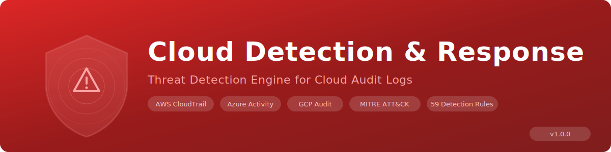

<p align="center">
  
</p>

# Cloud Detection & Response (CDR) Scanner

An open-source, zero-dependency Python-based **Cloud Detection & Response** engine that analyses cloud audit logs to detect threats, misconfigurations, and suspicious activity across **AWS CloudTrail, Azure Activity/Sign-in, and GCP Audit logs** -- mapped to the **MITRE ATT&CK Cloud Matrix**.

**No external dependencies required** -- runs on pure Python 3.10+ stdlib on Windows, macOS, and Linux.

---

## Why CDR?

Traditional SIEM rules miss cloud-native threats. This scanner fills the gap by detecting:

- **Root/admin account abuse** -- root console logins, Global Administrator assignments, Owner role bindings
- **Persistence mechanisms** -- backdoor IAM users, service account keys, access keys, Lambda backdoors
- **Privilege escalation** -- AdministratorAccess policies, wildcard IAM policies, cross-account role assumption
- **Defense evasion** -- CloudTrail stopped/deleted, GuardDuty disabled, diagnostic settings deleted, audit sinks removed
- **Credential theft** -- Secrets Manager access, SSM parameter retrieval, password policy weakening
- **Data exfiltration** -- S3/GCS buckets made public, EBS/RDS snapshots shared externally
- **Network tampering** -- security groups opened to 0.0.0.0/0, firewall rules deleted, VPC modifications
- **Destructive impact** -- instance termination, database deletion, KMS key destruction, cryptomining
- **Reconnaissance** -- API enumeration, bucket listing, infrastructure discovery

---

## Features

- **59 detection rules** across 3 cloud providers and 9 MITRE ATT&CK tactics
- **38 MITRE ATT&CK techniques** mapped (T1078, T1136, T1562, T1530, T1485, etc.)
- **7 compliance frameworks** -- CIS AWS/Azure/GCP, NIST 800-53, SOC 2, PCI-DSS, ISO 27001
- **Multi-cloud** -- AWS CloudTrail, Azure Activity/Sign-in Logs, GCP Cloud Audit Logs
- **Auto-detection** -- automatically identifies cloud provider from JSON log structure
- **Lambda-based conditions** -- contextual analysis beyond simple pattern matching
- **3 output formats** -- coloured console, JSON, interactive HTML
- **MITRE ATT&CK tactic summary** in console and HTML reports
- **Exit codes** -- returns `1` if CRITICAL or HIGH findings, `0` otherwise (CI/CD friendly)
- **Single file** -- entire scanner is one portable Python file with no pip installs needed

---

## Detection Rules (59 Rules)

### AWS CloudTrail (35 Rules)

| Tactic | Rule IDs | Count | Key Detections |
|--------|----------|-------|----------------|
| **Initial Access** | CDR-AWS-IA-001 to 004 | 4 | Root login, no MFA, failed login, unusual region |
| **Persistence** | CDR-AWS-PE-001 to 005 | 5 | User created, access key, login profile, Lambda, key pair |
| **Privilege Escalation** | CDR-AWS-PR-001 to 004 | 4 | AdministratorAccess, wildcard policy, inline policy, cross-account |
| **Defense Evasion** | CDR-AWS-DE-001 to 007 | 7 | CloudTrail stopped/deleted, GuardDuty disabled, Config stopped, flow logs deleted |
| **Credential Access** | CDR-AWS-CA-001 to 003 | 3 | Secrets Manager, SSM parameters, password policy |
| **Discovery** | CDR-AWS-DI-001 to 002 | 2 | Reconnaissance APIs, S3 enumeration |
| **Exfiltration** | CDR-AWS-EX-001 to 003 | 3 | S3 public, EBS snapshot public, RDS snapshot shared |
| **Network** | CDR-AWS-NET-001 to 003 | 3 | SG opened to 0.0.0.0/0, SG rule deleted, VPC modified |
| **Impact** | CDR-AWS-IM-001 to 005 | 5 | Instance terminated, RDS deleted, S3 deleted, cryptominer, KMS key deleted |

### Azure Activity / Sign-in Logs (14 Rules)

| Tactic | Rule IDs | Count | Key Detections |
|--------|----------|-------|----------------|
| **Initial Access** | CDR-AZ-IA-001 to 003 | 3 | Risky sign-in, failed sign-ins, no MFA |
| **Persistence** | CDR-AZ-PE-001 to 003 | 3 | User/guest created, app credentials, OAuth consent |
| **Privilege Escalation** | CDR-AZ-PR-001 to 002 | 2 | Global Admin assigned, privileged role assigned |
| **Defense Evasion** | CDR-AZ-DE-001 to 003 | 3 | Conditional Access disabled, diagnostics deleted, Defender disabled |
| **Network** | CDR-AZ-NET-001 | 1 | NSG rule allowing any source |
| **Impact** | CDR-AZ-IM-001 to 002 | 2 | Resource group deleted, Key Vault secret deleted |

### GCP Audit Logs (10 Rules)

| Tactic | Rule IDs | Count | Key Detections |
|--------|----------|-------|----------------|
| **Persistence** | CDR-GCP-PE-001 to 002 | 2 | Service account created, SA key created |
| **Privilege Escalation** | CDR-GCP-PR-001 to 002 | 2 | Owner/Editor role, custom role created |
| **Defense Evasion** | CDR-GCP-DE-001 to 002 | 2 | Audit sink deleted, firewall rule deleted |
| **Exfiltration** | CDR-GCP-EX-001 | 1 | GCS bucket made public |
| **Network** | CDR-GCP-NET-001 | 1 | Firewall 0.0.0.0/0 |
| **Impact** | CDR-GCP-IM-001 to 002 | 2 | Project/instance deleted, KMS key destroyed |

---

## MITRE ATT&CK Cloud Matrix Coverage

The scanner maps every detection to MITRE ATT&CK techniques:

| Tactic | Techniques |
|--------|------------|
| **Initial Access** | T1078, T1078.004, T1110, T1110.001, T1190, T1535 |
| **Persistence** | T1098, T1098.001, T1098.003, T1136, T1136.003, T1525, T1528 |
| **Privilege Escalation** | T1098.003, T1199 |
| **Defense Evasion** | T1562, T1562.001, T1562.008 |
| **Credential Access** | T1552, T1556 |
| **Discovery** | T1526, T1580, T1619 |
| **Exfiltration** | T1530, T1537 |
| **Network** | T1190, T1562.001, T1578 |
| **Impact** | T1485, T1496, T1578.003 |

---

## Compliance Frameworks

Every finding is mapped to applicable compliance frameworks:

| Framework | Scope |
|-----------|-------|
| **CIS AWS Foundations Benchmark** | AWS-specific cloud security controls |
| **CIS Azure Foundations Benchmark** | Azure-specific cloud security controls |
| **CIS GCP Foundations Benchmark** | GCP-specific cloud security controls |
| **NIST 800-53** | Federal information security controls |
| **SOC 2 Type II** | Service organisation controls |
| **PCI-DSS v4.0** | Payment card data protection |
| **ISO 27001:2022** | Information security management |

---

## Prerequisites

- **Python 3.10 or later** -- check with `python --version` or `python3 --version`
- **No pip installs needed** -- only Python standard library

---

## Installation

### Option 1: Clone the Repository

```bash
git clone https://github.com/Krishcalin/Cloud-Detection-Response.git
cd Cloud-Detection-Response
```

### Option 2: Download the Scanner File

```bash
curl -O https://raw.githubusercontent.com/Krishcalin/Cloud-Detection-Response/main/cdr_scanner.py
```

### Verify It Works

```bash
python cdr_scanner.py --version
# Output: CDR Scanner v1.0.0
```

---

## Quick Start

### 1. Scan Cloud Audit Logs

```bash
# Scan a directory of cloud log files
python cdr_scanner.py /path/to/cloud-logs/

# Scan a single CloudTrail log
python cdr_scanner.py cloudtrail-2026-03-12.json

# Scan an Azure Activity Log export
python cdr_scanner.py azure-activity-log.json
```

### 2. Generate Reports

```bash
# JSON report (machine-parseable, for SIEM/SOAR integration)
python cdr_scanner.py ./logs --json report.json

# HTML report (interactive, for incident response teams)
python cdr_scanner.py ./logs --html report.html

# Both reports at once
python cdr_scanner.py ./logs --json report.json --html report.html
```

### 3. Filter by Severity

```bash
# Only CRITICAL and HIGH
python cdr_scanner.py ./logs --severity HIGH

# Only CRITICAL
python cdr_scanner.py ./logs --severity CRITICAL
```

### 4. Verbose Mode

```bash
python cdr_scanner.py ./logs --verbose
```

---

## Usage

### CLI Reference

```
usage: cdr_scanner.py [-h] [--json FILE] [--html FILE]
                       [--severity {CRITICAL,HIGH,MEDIUM,LOW,INFO}]
                       [-v] [--version]
                       target

positional arguments:
  target                File or directory of cloud audit logs to analyse

options:
  -h, --help            Show help message and exit
  --json FILE           Save JSON report to FILE
  --html FILE           Save HTML report to FILE
  --severity SEV        Minimum severity (CRITICAL, HIGH, MEDIUM, LOW, INFO)
  -v, --verbose         Show files being scanned
  --version             Show scanner version
```

### Examples

```bash
# Scan current directory
python cdr_scanner.py .

# Scan AWS CloudTrail logs
python cdr_scanner.py /var/log/cloudtrail/

# Scan Azure Activity Log export
python cdr_scanner.py azure-activity-2026-03.json

# Scan GCP Audit Logs
python cdr_scanner.py gcp-audit-logs/

# Full scan with all outputs
python cdr_scanner.py ./cloud-logs --json report.json --html report.html --severity MEDIUM --verbose
```

---

## Supported Log Formats

| Cloud | Log Type | JSON Structures |
|-------|----------|-----------------|
| **AWS** | CloudTrail | `{"Records": [...]}`, single event `{"eventName": ...}`, array of events |
| **Azure** | Activity Log | `{"value": [...]}`, `{"records": [...]}`, single event `{"operationName": ...}` |
| **Azure** | Sign-in Log | Same as Activity Log with `properties.status`, `properties.riskLevel` |
| **GCP** | Cloud Audit | `{"entries": [...]}`, single event `{"protoPayload": ...}`, array of entries |

The scanner auto-detects the cloud provider from JSON structure -- no configuration needed.

---

## Contextual Detection (Lambda Conditions)

Unlike simple pattern-matching rules, the CDR scanner uses lambda-based condition functions for contextual analysis:

| Function | Cloud | What It Checks |
|----------|-------|----------------|
| `_ct_user_type` | AWS | Whether the caller is Root |
| `_ct_mfa_used` | AWS | Whether MFA was used for console login |
| `_ct_login_success` | AWS | Whether the login succeeded or failed |
| `_ct_unusual_region` | AWS | Whether the API call came from an unused region |
| `_ct_has_wildcard_policy` | AWS | Whether an IAM policy uses Action:* or Resource:* |
| `_ct_cross_account` | AWS | Whether a role assumption is cross-account |
| `_ct_s3_public` | AWS | Whether an S3 bucket was made publicly accessible |
| `_ct_snapshot_public` | AWS | Whether an EBS snapshot was shared with all |
| `_ct_sg_open` | AWS | Whether a security group allows 0.0.0.0/0 |
| `_ct_crypto_instance` | AWS | Whether a GPU/large instance type was launched (cryptomining) |
| `_az_risky_signin` | Azure | Whether a sign-in has elevated risk level |
| `_az_failed_signin` | Azure | Whether a sign-in attempt failed |
| `_az_no_mfa` | Azure | Whether MFA was not used |
| `_az_global_admin` | Azure | Whether the Global Administrator role was assigned |
| `_az_priv_role` | Azure | Whether a privileged directory role was assigned |
| `_gcp_owner_editor` | GCP | Whether roles/owner or roles/editor was granted |
| `_gcp_public_bucket` | GCP | Whether allUsers or allAuthenticatedUsers was granted |
| `_gcp_open_firewall` | GCP | Whether a firewall allows 0.0.0.0/0 |

---

## CI/CD Integration

The scanner returns exit code `1` if CRITICAL or HIGH findings are present:

### GitHub Actions

```yaml
name: Cloud Security Audit
on: [push, pull_request]

jobs:
  cdr-scan:
    runs-on: ubuntu-latest
    steps:
      - uses: actions/checkout@v4
      - uses: actions/setup-python@v5
        with:
          python-version: '3.12'
      - name: Run CDR Scanner
        run: python cdr_scanner.py ./cloud-logs --severity HIGH --json report.json --html report.html
      - name: Upload Report
        if: always()
        uses: actions/upload-artifact@v4
        with:
          name: cdr-report
          path: |
            report.json
            report.html
```

### GitLab CI

```yaml
cdr-scan:
  stage: test
  image: python:3.12-slim
  script:
    - python cdr_scanner.py ./cloud-logs --severity HIGH --json report.json --html report.html
  artifacts:
    paths: [report.json, report.html]
    when: always
```

---

## Testing with Sample Files

```bash
# Run against all test samples (expects 60+ findings)
python cdr_scanner.py tests/samples/ --verbose

# Generate full report
python cdr_scanner.py tests/samples/ --html test-report.html --json test-report.json
```

### Test Sample Files

| File | Cloud | Events | Expected Findings |
|------|-------|--------|-------------------|
| `cloudtrail_malicious.json` | AWS | 35 | 40+ (root login, IAM backdoor, CloudTrail deleted, S3 public, cryptominer) |
| `azure_activity_malicious.json` | Azure | 16 | 16+ (risky sign-in, Global Admin, Conditional Access deleted, Key Vault) |
| `gcp_audit_malicious.json` | GCP | 10 | 10+ (SA key, Owner role, audit sink deleted, public bucket, KMS destroyed) |

---

## Project Structure

```
Cloud-Detection-Response/
├── cdr_scanner.py              # Main scanner (single file, no dependencies)
├── banner.svg                  # Project banner
├── CLAUDE.md                   # Claude Code project instructions
├── LICENSE                     # MIT License
├── README.md                   # This file
├── .gitignore                  # Python gitignore
└── tests/
    └── samples/                # Simulated malicious cloud logs
        ├── cloudtrail_malicious.json
        ├── azure_activity_malicious.json
        └── gcp_audit_malicious.json
```

---

## Contributing

1. Add a rule dict to `AWS_RULES`, `AZURE_RULES`, or `GCP_RULES` in `cdr_scanner.py`.
2. Follow the ID pattern: `CDR-{CLOUD}-{TACTIC}-{NNN}` (e.g. `CDR-AWS-DE-008`).
3. Tactic abbreviations: IA, PE, PR, DE, CA, DI, EX, NET, IM.
4. Every rule must include: `id`, `tactic`, `name`, `severity`, `event_names`, `condition`, `description`, `recommendation`, `mitre`, `compliance`.
5. Add test events to the appropriate `tests/samples/*.json` file.
6. Run `python cdr_scanner.py tests/samples/ --verbose` to verify.

---

## License

This project is licensed under the MIT License -- see the [LICENSE](LICENSE) file for details.
